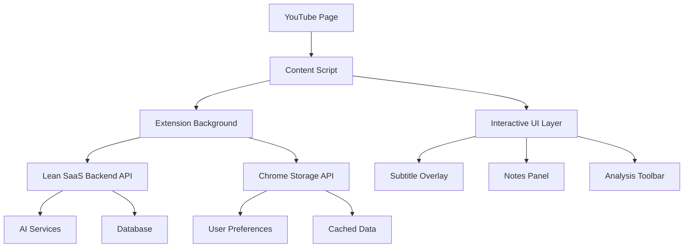

# TODO: YouTube Learning Co-pilot Extension - Project Implementation

## 📋 CURRENT TASK: Technical Specification Complete

### ✅ COMPLETED: THINK → PLAN → ACT Process
- **✅ THINK**: Analyzed YouTube Learning Co-pilot requirements from project document
- **✅ PLAN**: Created comprehensive technical specification leveraging Lean SaaS infrastructure
- **✅ ACT**: Documented architecture, services, pricing, and implementation roadmap

---

## 🎯 NEXT IMMEDIATE ACTIONS

### Phase 1: Foundation Setup (Week 1-2)
- [ ] **Clone and setup Lean SaaS environment**: Set up development environment
- [ ] **Research API rate limits**: Test YouTube Data API, Google Translate API quotas
- [ ] **Create Chrome Extension skeleton**: Basic manifest.json and folder structure
- [ ] **Design database schema extensions**: YouTube videos, notes, vocabulary tables

### Phase 2: Backend API Extensions (Week 3-4)
- [ ] **Module 7: YouTube Integration**: Add video analysis and transcript endpoints
- [ ] **Module 8: AI Processing**: Add translation, summarization, analysis endpoints  
- [ ] **Module 9: Learning Analytics**: Add vocabulary and progress tracking endpoints
- [ ] **Database migrations**: Implement extended schema with RLS policies

### Phase 3: Chrome Extension Core (Week 5-7)
- [ ] **Content script injection**: Basic YouTube page integration
- [ ] **Interactive subtitles**: Hover translation, click-to-save functionality
- [ ] **Authentication flow**: JWT token management in extension
- [ ] **API integration**: Connect extension to Lean SaaS backend

---

## 📊 PROJECT SPECIFICATIONS SUMMARY

### Technical Architecture
✅ **Backend Foundation**: Lean SaaS 6-layer architecture (fully completed)
✅ **Extension Structure**: Chrome Extension with content scripts + popup
✅ **Database Design**: Extended schema for YouTube integration
✅ **Authentication**: JWT + API Key system (already implemented)

### Service Integration Strategy  
✅ **Translation**: Google Translate API (500k chars/month free)
✅ **AI Processing**: OpenAI GPT-4o Mini ($0.15/1M tokens) 
✅ **YouTube Data**: YouTube Data API v3 (10k units/day free)
✅ **Dictionary**: WordsAPI (2.5k requests/day free)

### Financial Projections
✅ **Operating Costs**: $90-105/month for 1000 users ($0.09-0.105 per user)
✅ **Revenue Model**: Freemium ($4.99 Premium, $9.99 Pro)
✅ **Break-even**: 19-22 premium subscribers
✅ **Year 1 Target**: 30k users, $30k MRR, $360k ARR

---

## 🚀 IMPLEMENTATION ROADMAP

### Milestone 1: MVP Development (Month 1-2)
- Basic extension with English learning module
- Interactive subtitles with translation
- Note-taking with timestamps
- User authentication

### Milestone 2: AI Features (Month 3)  
- Video summarization (GPT-4o Mini)
- Vocabulary management system
- Export functionality
- Premium subscription integration

### Milestone 3: Critical Thinking Module (Month 4)
- Source credibility analysis
- Fact vs opinion detection  
- Counter-perspective suggestions
- Comment quality filtering

### Milestone 4: Launch & Scale (Month 5-6)
- Chrome Web Store submission
- Beta user testing and feedback
- Performance optimization
- Marketing and user acquisition

---

## 💡 KEY SUCCESS FACTORS

### Technical Excellence
- **Proven Infrastructure**: Built on battle-tested Lean SaaS foundation
- **Scalable Architecture**: API-first design supports multiple clients
- **Security First**: RLS, authentication, rate limiting already implemented
- **Zero-ops Deployment**: Automated CI/CD pipeline ready

### Market Opportunity
- **Unique Position**: Only extension combining English learning + knowledge + critical thinking
- **Large TAM**: 2B+ YouTube users, growing online learning market
- **AI-Powered**: Leverages latest AI capabilities for smart content analysis
- **Monetization Ready**: Clear freemium model with proven conversion potential

### Competitive Advantages
1. **All-in-One Solution**: Single extension for multiple learning needs
2. **AI-Enhanced**: Smart content analysis and personalized recommendations  
3. **Non-Intrusive**: Seamless YouTube integration without disrupting experience
4. **Enterprise Backend**: Production-ready infrastructure from day one
5. **Critical Thinking Focus**: Unique media literacy features not found elsewhere

---

**🎯 PROJECT STATUS**: Ready to begin Phase 1 implementation
**📅 ESTIMATED COMPLETION**: 6 months to launch-ready product
**💰 INVESTMENT REQUIRED**: $500-1000 for initial development and APIs
**🚀 POTENTIAL ROI**: $360k ARR within first year**

---

## 🏗️ TECHNICAL ARCHITECTURE

### Leverage Existing Lean SaaS Infrastructure

**✅ Already Available from Lean SaaS Repo:**
- **Backend API Foundation**: 6-layer architecture with 50+ endpoints
- **Authentication System**: JWT + API Keys (Layer 5) 
- **Database Layer**: PostgreSQL with RLS, migrations (Layer 2)
- **Security Layer**: CORS, rate limiting, request sanitization (Layer 1)
- **Logging & Monitoring**: Comprehensive logging system (Layer 1)
- **Testing Infrastructure**: 95% coverage with integration tests (Layer 3)
- **Billing System**: Stripe integration for subscription management (Layer 6)
- **Deployment Pipeline**: Zero-ops CI/CD with GitHub Actions

**🔄 Extensions Needed for YouTube Extension:**
- **Chrome Extension API Wrapper** - Content scripts and popup UI
- **YouTube Data Integration** - Video metadata, transcript extraction
- **AI Processing Services** - Translation, summarization, analysis
- **Real-time Sync** - Extension ↔ Backend communication

---

## 🎯 CHROME EXTENSION ARCHITECTURE

### Extension Structure
```
youtube-learning-extension/
├── manifest.json              # Extension configuration
├── background/                # Service worker
│   ├── service-worker.js     # Background tasks
│   └── api-client.js         # Backend API communication
├── content/                  # Content scripts
│   ├── youtube-injector.js   # Main YouTube integration
│   ├── subtitle-handler.js   # Interactive subtitles
│   ├── notes-manager.js      # Note taking system
│   └── analysis-overlay.js   # Critical thinking features
├── popup/                    # Extension popup
│   ├── popup.html           # Settings and dashboard
│   ├── popup.js             # Popup logic
│   └── popup.css            # Popup styling
├── options/                  # Options page
│   ├── options.html         # Extension settings
│   └── options.js           # Settings management
└── assets/                   # Icons and resources
    ├── icons/               # Extension icons
    └── styles/             # Shared CSS
```

### Data Flow Architecture


---

## 🔧 BACKEND API EXTENSIONS

### New Modules to Add to Lean SaaS

#### Module 7: YouTube Integration Module
```typescript
// API Endpoints needed:
POST /api/v1/youtube/video/analyze      # Extract video metadata
POST /api/v1/youtube/transcript/get     # Get/process transcript
POST /api/v1/youtube/notes/save         # Save timestamped notes
GET  /api/v1/youtube/notes/:videoId     # Get notes for video
DELETE /api/v1/youtube/notes/:id        # Delete note
```

#### Module 8: AI Processing Module
```typescript
// API Endpoints needed:
POST /api/v1/ai/translate               # Word/phrase translation
POST /api/v1/ai/summarize              # Video summarization
POST /api/v1/ai/analyze-sentiment      # Content analysis
POST /api/v1/ai/find-counterpoints     # Find opposing viewpoints
POST /api/v1/ai/extract-facts          # Fact vs opinion analysis
```

#### Module 9: Learning Analytics Module
```typescript
// API Endpoints needed:
POST /api/v1/learning/vocabulary/save   # Save learned words
GET  /api/v1/learning/vocabulary/list   # Get vocabulary list
POST /api/v1/learning/progress/update   # Update learning progress
GET  /api/v1/learning/analytics/stats   # Learning statistics
```

### Database Schema Extensions
```sql
-- YouTube Videos tracking
CREATE TABLE youtube_videos (
  id UUID PRIMARY KEY DEFAULT gen_random_uuid(),
  user_id UUID REFERENCES auth.users(id),
  video_id TEXT NOT NULL,
  title TEXT,
  channel_name TEXT,
  duration INTEGER,
  created_at TIMESTAMP DEFAULT NOW()
);

-- Timestamped notes
CREATE TABLE video_notes (
  id UUID PRIMARY KEY DEFAULT gen_random_uuid(),
  user_id UUID REFERENCES auth.users(id),
  video_id UUID REFERENCES youtube_videos(id),
  timestamp INTEGER NOT NULL,
  content TEXT NOT NULL,
  created_at TIMESTAMP DEFAULT NOW()
);

-- Vocabulary tracking
CREATE TABLE vocabulary_entries (
  id UUID PRIMARY KEY DEFAULT gen_random_uuid(),
  user_id UUID REFERENCES auth.users(id),
  word TEXT NOT NULL,
  definition TEXT NOT NULL,
  context TEXT,
  video_id UUID REFERENCES youtube_videos(id),
  timestamp INTEGER,
  learned_at TIMESTAMP DEFAULT NOW()
);

-- Learning analytics
CREATE TABLE learning_sessions (
  id UUID PRIMARY KEY DEFAULT gen_random_uuid(),
  user_id UUID REFERENCES auth.users(id),
  video_id UUID REFERENCES youtube_videos(id),
  duration INTEGER,
  words_learned INTEGER DEFAULT 0,
  notes_taken INTEGER DEFAULT 0,
  session_date DATE DEFAULT CURRENT_DATE
);
```

---

## 🛠️ REQUIRED SERVICES & PRICING

### Tier 1: Free/Low-Cost Services (Prioritized)

#### Translation & Dictionary Services
1. **Google Translate API** (Google Cloud)
   - **Free**: 500,000 chars/month (Basic + Advanced combined)
   - **Paid**: $20/1M chars for Basic/Advanced models
   - **Translation LLM**: $10/1M input + $10/1M output chars
   - Use case: Word/phrase translation English→Vietnamese

2. **WordsAPI** (RapidAPI)
   - **Free**: 2,500 requests/day 
   - **Pro tiers**: Available on RapidAPI marketplace
   - Use case: Word definitions, pronunciation, examples, synonyms

3. **DeepL API** (High-quality alternative)
   - **Free**: 500,000 chars/month
   - **Pro**: $5.49/month base + usage-based pricing
   - Use case: High-quality translation (better than Google for European languages)

#### YouTube Integration
4. **YouTube Data API v3** (Google Cloud)
   - **Free**: 10,000 units/day (completely free, no payment required)
   - **Quota increase**: Requires audit process for >10,000 units/day
   - **Cost per operation**: 1-100 units (search = 100 units, video details = 1 unit)
   - Use case: Video metadata, channel info, comments

5. **YouTube Transcript API** (Unofficial)
   - **Free**: Community libraries (youtube-transcript-api)
   - Use case: Extract video transcripts/subtitles

#### AI Processing Services
6. **OpenAI API** (Latest 2025 pricing)
   - **GPT-4o Mini**: $0.15/1M input + $0.60/1M output tokens
   - **GPT-4o**: $2.50/1M input + $10.00/1M output tokens
   - **GPT-4.1**: 26% cheaper than GPT-4o (newest model)
   - **o1-mini**: $1.10/1M input + $4.40/1M output tokens
   - Use case: Summarization, analysis, fact extraction

7. **Google Gemini API** (Competitive alternative)
   - **Gemini 1.5 Flash**: $0.075/1M input + $0.30/1M output tokens
   - **Gemini 1.5 Pro**: $1.25/1M input + $5.00/1M output tokens
   - **Free tier**: Available in Google AI Studio
   - Use case: Content analysis, multimodal processing

8. **Hugging Face API** (Open source models)
   - **Free tier**: Rate limited
   - **Pro**: Starting from $0.50/hour
   - Use case: Sentiment analysis, text classification

### Tier 2: Enhanced Services (Paid)

#### Advanced Translation
9. **DeepL API** (High quality translation)
   - €5.99/month for 1M chars
   - Use case: High-quality translation

10. **Azure Cognitive Services** (Microsoft)
    - Free tier: 2M chars/month
    - $10/1M chars beyond free
    - Use case: Translation + pronunciation

#### Content Analysis
11. **Wolfram Alpha API**
    - $5/month for 2,000 queries
    - Use case: Fact checking, data analysis

12. **Perspective API** (Google)
    - Free with rate limits
    - Use case: Comment quality analysis

#### News & Source Verification
13. **NewsAPI**
    - Free: 1,000 requests/day
    - $449/month for commercial use
    - Use case: Find counter-perspective articles

14. **Ground News API**
    - Custom pricing
    - Use case: Political bias analysis

### Tier 3: Database & Infrastructure

#### Vector Database (for AI features)
15. **Pinecone** (Vector search)
    - Free tier: 1M vectors
    - $70/month for 5M vectors
    - Use case: Semantic search, similar content

16. **Weaviate Cloud** (Alternative)
    - Free tier available
    - Use case: Vector search, recommendations

---

## 🎨 USER EXPERIENCE DESIGN

### Chrome Extension UI Components

#### 1. Floating Toolbar (Always Visible)
- **Module Toggle Buttons**: EN | Knowledge | Critical
- **Settings Gear**: Quick access to preferences
- **Status Indicator**: API connection, processing status

#### 2. Interactive Subtitle Overlay
- **Hover Dictionary**: Word definitions on hover
- **Click to Save**: Add words to vocabulary
- **Phrase Selection**: Multi-word phrase translation
- **Context Menu**: Save phrase, hear pronunciation

#### 3. Smart Notes Panel (Collapsible)
- **Timestamp Notes**: Click to add note at current time
- **AI Summary**: Auto-generated video summary
- **Export Options**: Copy notes, export to markdown

#### 4. Critical Analysis Sidebar
- **Source Info Card**: Channel type, credibility indicator
- **Fact vs Opinion**: Highlighted text differentiation
- **Counter-Perspective**: Suggested opposing viewpoints
- **Comment Filter**: Quality comment detection

### Hotkey System
- `Alt + N`: Quick note at current timestamp
- `Alt + T`: Toggle translation overlay
- `Alt + S`: Generate summary
- `Alt + A`: Toggle analysis mode
- `Ctrl + E`: Export notes and summary

---

## 🚀 DEVELOPMENT PHASES

### Phase 1: Foundation (2 weeks)
- **Backend Extensions**: Add YouTube, AI, and Learning modules to Lean SaaS
- **Chrome Extension Skeleton**: Basic structure with content script injection
- **API Integration**: Connect extension to backend APIs
- **Basic Authentication**: JWT token management in extension

### Phase 2: English Learning Module (3 weeks)
- **Interactive Subtitles**: Hover translation, click to save
- **Vocabulary Management**: Save words, flashcard system
- **Phrase Detection**: Multi-word phrase handling
- **Offline Support**: Cache frequently used translations

### Phase 3: Knowledge Module (2 weeks)
- **Timestamped Notes**: Note-taking with video synchronization
- **AI Summarization**: GPT-powered video summaries
- **Export System**: Export notes and transcripts

### Phase 4: Critical Thinking Module (3 weeks)
- **Source Analysis**: Channel credibility assessment
- **Content Analysis**: Fact vs opinion detection
- **Counter-Perspective**: Find opposing viewpoints
- **Comment Quality**: Filter high-quality discussions

### Phase 5: Polish & Launch (2 weeks)
- **UI/UX Refinement**: Smooth animations, responsive design
- **Performance Optimization**: Lazy loading, caching strategies
- **Chrome Web Store**: Submission and approval process
- **User Testing**: Beta testing with real users

---

## 💰 COST ESTIMATION

### Monthly Operating Costs (1000 Active Users)

#### Free Tier Usage (Estimated)
- **Google Translate**: $0 (within 500k chars/month free limit)
- **YouTube Data API**: $0 (within 10k units/day free limit)
- **WordsAPI**: $0 (within 2.5k requests/day free limit)
- **YouTube Transcript**: $0
- **Total Free Services**: $0/month

#### AI Processing (Moderate Usage Scenario)
- **OpenAI GPT-4o Mini**: ~$30/month (summary + analysis features)
- **Google Gemini Flash**: ~$15/month (alternative/backup AI)
- **Total AI**: ~$45/month

#### Enhanced Features (Optional)
- **DeepL API Pro**: ~$15/month (premium translation quality)
- **Total Enhanced**: ~$15/month

#### Lean SaaS Infrastructure
- **Supabase**: $25/month (Pro tier for production)
- **Vercel**: $20/month (Pro tier for extension hosting)
- **Chrome Web Store**: $5 one-time developer fee
- **Total Infrastructure**: ~$45/month

#### **Total Estimated Operating Cost**: 
- **Basic Plan**: $90/month (1000 users) = $0.09 per user
- **Premium Plan**: $105/month (1000 users) = $0.105 per user

#### Scaling Projections
- **10k users**: ~$200-300/month ($0.02-0.03 per user)
- **100k users**: ~$800-1200/month ($0.008-0.012 per user)
- **1M users**: ~$5000-8000/month ($0.005-0.008 per user)

### Revenue Strategy & Business Model

#### Freemium Model Structure
**Free Tier** (Supported by free API limits):
- Basic word translation (Google Translate free tier)
- Simple note-taking with timestamps  
- Basic video metadata access
- Limited to 50 vocabulary saves/day
- Basic fact vs opinion highlighting

**Premium Subscription** ($4.99/month):
- Unlimited AI-powered video summaries (GPT-4o Mini)
- Advanced critical thinking analysis
- Unlimited vocabulary saves with spaced repetition
- High-quality translation (DeepL integration)
- Export notes to multiple formats
- Counter-perspective article suggestions
- Priority customer support

**Pro Subscription** ($9.99/month):
- All Premium features
- Advanced AI analysis (GPT-4o for complex reasoning)
- Custom glossaries and terminology management
- Team collaboration features
- Advanced analytics and learning insights
- API access for power users

#### Revenue Projections
**Break-even Analysis**:
- **Operating cost**: $90-105/month (1000 users)
- **Break-even point**: 19-22 premium subscribers
- **Conservative conversion**: 3-5% premium conversion rate
- **Minimum user base for sustainability**: 500-750 users

**Growth Projections** (Year 1):
- **Month 1-3**: 1,000 users (beta launch)
- **Month 4-6**: 5,000 users (Chrome Web Store featured)
- **Month 7-9**: 15,000 users (word-of-mouth growth)
- **Month 10-12**: 30,000 users (mature product)

**Revenue Potential** (Month 12):
- **Free users**: 25,500 (85%)
- **Premium users**: 3,000 (10% @ $4.99) = $14,970/month
- **Pro users**: 1,500 (5% @ $9.99) = $14,985/month
- **Total MRR**: ~$30,000/month
- **Annual revenue**: ~$360,000

---

## 📊 SUCCESS METRICS

### User Engagement
- Daily Active Users (DAU)
- Time spent with extension active
- Notes taken per session
- Words saved to vocabulary

### Learning Effectiveness
- Vocabulary retention rate
- User-reported learning improvement
- Feature usage distribution

### Technical Performance
- API response times
- Extension load time
- Error rates
- User satisfaction scores

---

## 🔒 SECURITY & PRIVACY

### Data Protection
- **Minimal Data Collection**: Only necessary learning data
- **Encryption**: All data encrypted in transit and at rest
- **User Control**: Export and delete personal data
- **Compliance**: GDPR-compliant data handling

### YouTube Terms Compliance
- **No Video Download**: Only transcript and metadata
- **Respect Rate Limits**: Proper API usage
- **User Consent**: Clear consent for data processing
- **Attribution**: Proper credit to content creators

---

## 🎯 COMPETITIVE ADVANTAGES

1. **All-in-One Solution**: Single extension for 3 different learning needs
2. **AI-Powered Intelligence**: Smart content analysis and recommendations
3. **Critical Thinking Focus**: Unique feature for media literacy
4. **Seamless Integration**: Non-intrusive YouTube experience
5. **Proven Backend**: Built on battle-tested SaaS infrastructure

---

## 📈 NEXT STEPS

### Immediate Actions (This Week)
1. **Set up development environment**: Clone Lean SaaS repo
2. **Research API limitations**: Test YouTube and translation APIs
3. **Create wireframes**: Design extension UI components
4. **Plan database schema**: Extend existing database structure

### Short-term Goals (Next Month)
1. **MVP Development**: Basic extension with core features
2. **API Integration**: Connect all external services
3. **User Testing**: Internal testing with beta users
4. **Performance Optimization**: Optimize for smooth YouTube experience

### Long-term Vision (3-6 Months)
1. **Chrome Web Store Launch**: Public release
2. **User Acquisition**: Marketing and user onboarding
3. **Feature Expansion**: Advanced AI features
4. **Mobile App**: Extend to mobile YouTube experience

---

**🎉 This extension will transform how people learn from YouTube, making every video an interactive learning opportunity while maintaining the seamless viewing experience users love.**